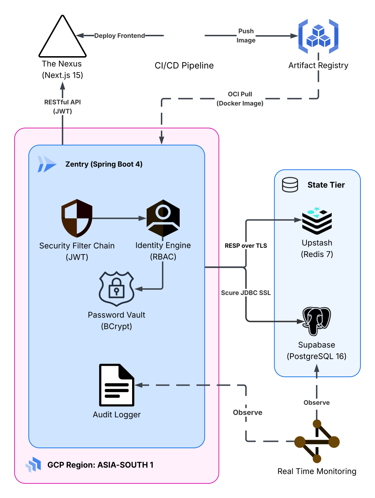

# Zentry Identity Management System

Zentry is a high-performance backend infrastructure designed for secure identity management, authentication, and administrative oversight. Built on the latest Java and Spring Boot ecosystems, it provides a production-grade environment featuring JWT-based authentication, Redis-backed rate limiting, and automated audit logging.

## Prerequisites

To run this project, the following components must be installed on the host system:

- **Java Development Kit (JDK) 25** (OpenJDK recommended)
- **Apache Maven 3.9+**
- **Docker and Docker Compose** (for PostgreSQL and Redis orchestration)

## Tech Stack

- **Framework:** Spring Boot 4.0.3
- **Security:** Spring Security 7.0
- **Language:** Java 25
- **Persistence:** Spring Data JPA (Hibernate 7.x)
- **Database:** PostgreSQL 16
- **Caching/State Management:** Redis 7 (Alpine)
- **Serialization:** Jackson 3.0 (utilizing the `tools.jackson` namespace)
- **AOP:** AspectJ for automated audit interceptors

## System Architecture

<div align="center">
  
</div>

## Getting Started

### 1. Infrastructure Setup (Docker)

The system utilizes Docker Compose to orchestrate the PostgreSQL and Redis instances. This ensures a consistent environment for the primary data ledger and the high-speed caching layer used for rate limiting and token blacklisting.

Execute the following command in the project root to start the required services:

```bash
docker-compose up -d
```

**Services Overview:**

- **PostgreSQL:** Handles persistent storage for users, roles, permissions, and audit logs.
- **Redis:** Manages short-lived data including JWT blacklists, API rate-limit buckets, and 15-minute password reset tokens.

---

### **2. Database and Cache Configuration**

The application requires a cryptographically secure secret key to sign and verify JWTs. You can generate a 256-bit key on Arch Linux (or any system with OpenSSL) using the following command:

```bash
openssl rand -base64 32
```

Ensure the following properties are configured in `src/main/resources/application.properties` or set as environment variables to match the Docker environment credentials:

```properties
# Database Configuration
spring.datasource.url=jdbc:postgresql://localhost:5432/zentry_iam
spring.datasource.username=ranxom
spring.datasource.password=super_secure_password

# Redis Configuration
spring.data.redis.host=localhost
spring.data.redis.port=6379

# Security Configuration
# Replace with the output from: openssl rand -base64 32
zentry.security.jwt.secret=PASTE_GENERATED_KEY_HERE
zentry.security.jwt.expiration=3600000         # 1 hour in ms
zentry.security.jwt.refresh-expiration=604800000 # 7 days in ms
```

---

### 3. Build and Run

Execute the following commands in the project root:

```bash
# Install dependencies and build the artifact
./mvnw clean install

# Run the application
./mvnw spring-boot:run
```

The server will initialize on `http://localhost:8080`.

## API Documentation

### Authentication Gateways (`/api/auth`)

| Method | Endpoint                    | Description                                                    |
| ------ | --------------------------- | -------------------------------------------------------------- |
| `POST` | `/api/auth/register`        | Creates a new user identity.                                   |
| `POST` | `/api/auth/login`           | Exchanges credentials for Access (JWT) and Refresh tokens.     |
| `POST` | `/api/auth/refresh`         | Generates a new access token using a valid refresh token.      |
| `POST` | `/api/auth/logout`          | Revokes the current session and blacklists the token in Redis. |
| `POST` | `/api/auth/forgot-password` | Generates a 15-minute reset token stored in Redis.             |
| `POST` | `/api/auth/reset-password`  | Resets user password using a valid reset token.                |

### User Services (`/api/users`)

| Method | Endpoint                | Authorization   | Description                                               |
| ------ | ----------------------- | --------------- | --------------------------------------------------------- |
| `GET`  | `/api/users/me`         | `Authenticated` | Returns the profile data of the currently logged-in user. |
| `GET`  | `/api/users/admin-only` | `SYSTEM_READ`   | Verifies administrative access levels.                    |

### Administrative Council (`/api/admin`)

| Method  | Endpoint                            | Authority     | Description                                            |
| ------- | ----------------------------------- | ------------- | ------------------------------------------------------ |
| `GET`   | `/api/admin/logs`                   | `SYSTEM_READ` | Retrieves the complete system audit log history.       |
| `GET`   | `/api/admin/status`                 | `ROLE_ADMIN`  | Returns real-time health data for DB and Redis layers. |
| `GET`   | `/api/admin/users`                  | `SYSTEM_READ` | Lists all registered users and their current statuses. |
| `PATCH` | `/api/admin/users/{id}/toggle-lock` | `USER_WRITE`  | Locks or unlocks a specific user account.              |
| `PUT`   | `/api/admin/users/{id}`             | `USER_WRITE`  | Updates metadata for an existing user account.         |

## Security Architecture

### Layered Defense

1. **Rate Limiting:** IP-based request throttling using the Token Bucket algorithm (Bucket4j). Requests are limited to 5 per minute per IP. The filter is hardened to "fail open" if Redis connectivity is interrupted to maintain availability.
2. **JWT Authentication:** Stateless session management. Access tokens are validated against a Redis-based blacklist to support immediate revocation upon logout.
3. **Audit Interceptor:** An AOP-based Aspect monitors methods annotated with `@Auditable`. It automatically captures actor IDs, action types, IP addresses, and metadata, while masking sensitive fields (passwords/tokens) before persisting to PostgreSQL.

### Role-Based Access Control (RBAC)

The system uses a hierarchical permission model:

- **Roles:** Groups of permissions (e.g., `ROLE_USER`, `ROLE_ADMIN`).
- **Permissions:** Granular authorities (e.g., `SYSTEM_READ`, `USER_WRITE`) mapped to roles.
- **Method Security:** Secured via `@PreAuthorize` annotations at the controller level.

## Testing

The project maintains a 100% coverage suite for all controller endpoints. Tests utilize `WebMvcTest` with a custom `BaseControllerTest` to handle security filter mocking, CSRF handshakes, and Jackson 3.0 compatibility.

Run tests using:

```bash
./mvnw test
```

## Error Handling

Global exceptions are managed by `GlobalExceptionHandler`, ensuring standardized JSON responses for:

- **403 Forbidden:** Insufficient authorities or denied access.
- **401 Unauthorized:** Invalid or missing credentials.
- **429 Too Many Requests:** Rate limit threshold exceeded.
- **409 Conflict:** Business logic or runtime violations.

---

**Lead Developer:** Shizain
**Project Status:** Hardened / Production-Ready Backend Base.
